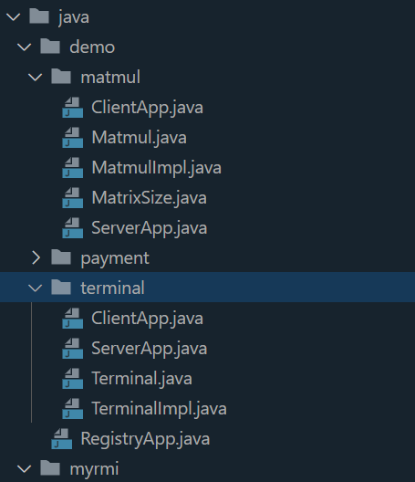
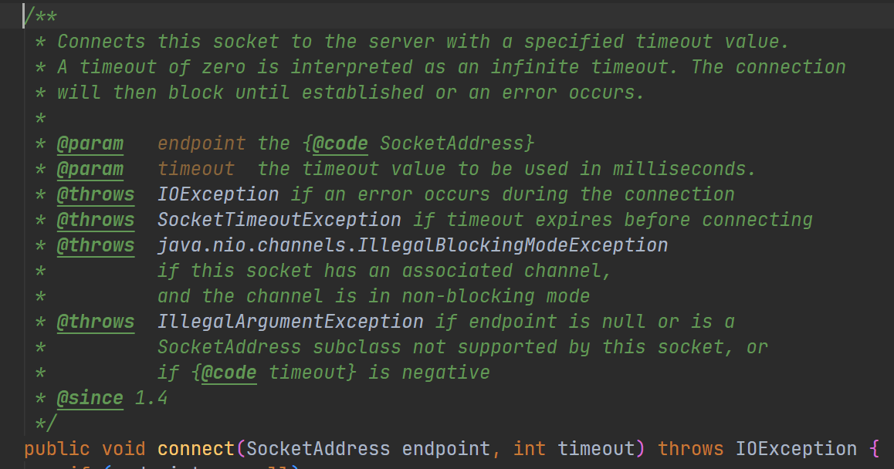
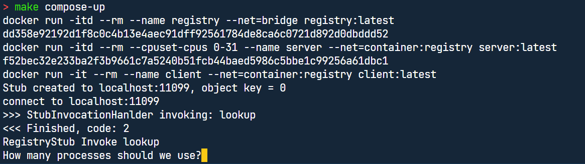
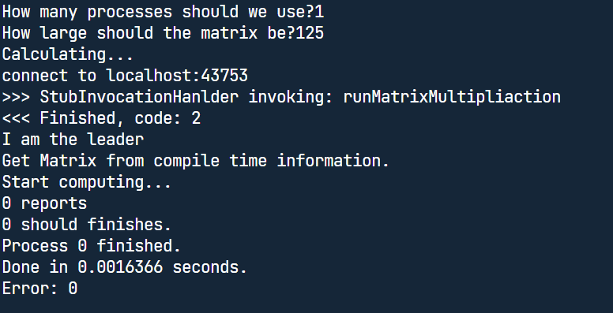
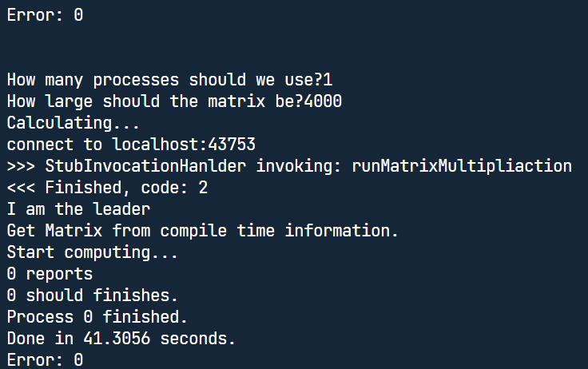
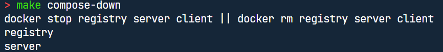
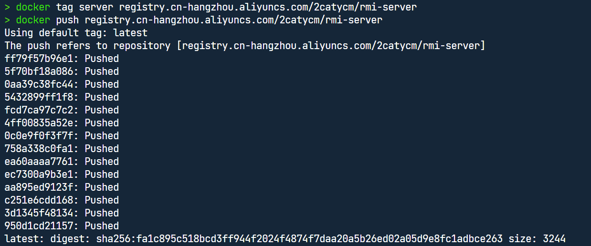

# Learning Docker by Making a RMI compose system 

<div align="center">
    叶璨铭（YeCanming）, 12011404 <br>
    南方科技大学（SUSTech） <br>
    12011404@mail.sustech.edu.cn <br>
</div>

## Contents

[TOC]

## Part 1 Introduction

### Requirement

In this assignment, we are going to establish a RMI Pod. 

A Pod[^1][^2] is  a set of containers, which shares

- resources
  - memory
  - network
  - context (Linux namespace)
- declarations (of what the container is)

The RMI Pod we are required to develop contains three 3 containers

- Registry application

  - a java program that starts up a RMI Registry by RMI library.

  - a container that 
    - needs java env
    - needs RMI library
    - exposes RMI Registry port
- Server application
  - a java project whose artifact is a java program and runs as a process
  - the java program uses RMI library implemented in Assignment 2. 
  - the java program exports remote objects to the RMI registry as services
  - remote objects include
    - MPI matrix multiplication test.
      - The object API
        - arguments: different matrix size and cpu numbers. 
        - invoke the object can test the performance of matrix multiplication 
      - The object implementation
        - invoke the MPI based program we implemented in Assignment 1. 
  - a container that
    - needs java env
    - needs RMI library
    - needs MPI program env
    - knows where is the RMI Registry
    - exposes IP and port, for client to invoke object
- Client application

### Objectives

- Reproducible
- Elegant
  - Reduce redundant information in the code stacking together. 
  - Use automatic tools to help
- Fast
  - The Performance of MPI Matrix Multiplication should not be too slow than before containerization.
  - Use Intel Compilers for Intel CPU whenever possible.
- Lightweight
  - The image we built should be as small as possible.
  - Use smart multi-stage building.
- Safe
  - The image should not be vulnerable. 
  - The pod should be isolated from the host.


### Some notable issues

## Part 2 Preliminary

### Docker Image Building with Dockerfile

#### How to understand the effect of "EXPOSE" correctly?

Firstly, EXPOSE is not a must to map a port inside container to outside world. We can always use `-p` to expose container port to the host. Note that "-p A/tcp:B", A is always a host OS port, even "-p ip:A/tcp:B", A is still a port on host OS, ip:A merely means a firewall rule that only ip should be able to access port A on host.[^16] 

Actually, EXPOSE is for the option "-P". "-P" will recognize all ports that EXPOSE declared and maps them automatically. But **it is really useless since the ports that it maps are random.** [^21]

The blog writer[^21]argued that EXPOSE is for "--net=host". He thinks that EXPOSE is useful in that when using "--net=host", the ports declared in EXPOSE will be exposed automatically.[^21] But he is wrong. Even without EXPOSE, anytime a process inside the container needs to bind an OS port, it will try to bind the port on the host OS. His understanding is misleading. 

In fact, the main effect and the only effect of "EXPOSE" is for documentation, as [^22]stated. **Besides "-P", EXPOSE has no effect on the Docker system. It is just a human reading stuff.**    

#### What is the difference of `RUN/CMD/ENTRYPOINT ['exe', 'arg']` and `RUN/CMD/ENTRYPOINT <command> `? 

We have the these things in Java/Python standard process libraries too. 

- List Style

  - The Shell syntax are disabled.  For example, "echo hello && echo world" ouputs "hello && echo world" because the shell syntax "&&" is not enabled. 
  - tokens are not separated by shell, but by list. So "D:/A/B C/D E/ " becomes valid path.

- Command Style

  - The Shell syntax are enabled. For example, "echo hello && echo world" is "hello\n world"

  - tokens are separated by shell.

  - Vulnerable by injection. 

    - For example, OJ system executes the uploaded java program.

      ```python
      command = f"javac {uploaded_program_name}"
      os.system(command)
      ```

    - Then user may rename their file to `uploaded_program_name='"&& rm -rf /*'`
    - Then the OJ system will be attacked by command injection.

The underlying story why this two style exists is that, the Linux OS acknowledge the first style as system call[^20], while the second is library call and different shell by shell. 

#### How to understand the complex relationship of "ENTRYPOINT" and "CMD"?


#### Is it possible to inherit multiple base images to make a single new image?

It is a very reasonable requirement that we needs multiple environment in one container.[^5][^4] For example, 

- MPI needs image "openmpi" to run
- RMI needs image "openjre" to run
- How do we get the hybrid image that contains the file of "openmpi" and "openjre" automatically?

If we are using package managers, like `apt`\ `pip` \ `conda` \ `spack`, it is definitely OK and reasonable to install many packages, like we can install "openmpi" and then install "openjre". 

However, in Docker, it is only possible to inherit the image from one parent, not multi-parents.[^5]This is because images are considered atomic components that cannot be automatically merged with its building process. [^5]

To address this issue, I find the best practice is to export the environment to container from package managers. **By this end, we can use the logic of package manager to build the best slimed compact images with hybrid environment requirements.** This is well supported by `spack`. We will discuss this later. 

Although we cannot use multi-parent inheritance in docker, we can use multi-stage building, which is a nice paradigm that reduces the image size.[^3] 

### Docker Container Running

#### Will the space consumed scales up as the number of containers increase?

No, because of the Linux overlay system is powerful.[^19]The modification on upper layer doesn't affect the underlying layers, instead, modifications are considered new layers. By this good design, layers are immutable so that the underlying layers, no matter how big, can be shared and reused. 

#### What network environment is a container in?

Container networking refers to the ability for containers to connect to and communicate with each other, or to non-Docker workloads.[^16]

In this assignment, it is very important to figure out the arrangement of network environment for the three containers. The communication requirements between them include:

- Client finds Registry, and Registry listens to its port. 
- Server finds Registry, and Registry listens to its port. 
- Client finds Server, and Server listens to its port.

Our ideal may be 

- Solution1:
  - create an isolated network that is different from the host. 
  - **the three containers run in the same single isolated network, and they all call the network "localhost" .**
  - They find each other by that network, but not the host.
- Solution2:
  - **the three containers has three different isolated networks.**
  - the three containers expose their service port to the host.
  - the three containers find others by "host.docker.internal", which refers to the host. 
- Solution3:
  - **the three containers has three different isolated networks.**
  - the RMI reads Environment variable to know the name of other containers.
  - then RMI finds each others by the container name, which becomes proper IP to the target container by DNS preconfigured by docker.


One of my classmates adopted the second solution, but I think the first is more elegant. To achieve the first solution, here are some docker knowledge that we have to learn.

##### Docker Network

When we use `docker run`, we create a container. What is the network environment inside the container we create? This depends on how we use docker run——we can pass `--net=<network_name>` to specify the network that should be used by the container. [^15]

In docker, "network" is a concept that can be create/remove/connect/disconnect.  [^17]We can use `docker network ls` to see all networks that are usable, just like the concept of "image" or "container". [^15]

From my experiment, one container can "connect" to many "network"s. So we can infer that "network" acts as network card hardware plug on container. Actually,  a container only sees a network interface with an IP address, a gateway, a routing table, DNS services, and other networking details.[^16]

When we install docker, there are three default networks that can be used, bridge, host, and none. "bridge" is the default network used if we do not specify. [^15]

When using "host", the container's network environment is exactly the same as the host. **When using "bridge", Docker uses "Linux Network Namespace" to isolate the container with the host, creating a virtual network card (and therefore creating virtual MAC and IP for the card) for the newly created container. When using "none", the container does not see any network card and therefore cannot connect to anything outside the container**.[^15]

For this assignment, it is a possible solution to let the three container both uses "host" to connect to each other like how they connect to each other in the host. This is easy but someone may criticize that it is not safe.  

There is also a mode called "container", that allow us to let a new container share the existing container bridge network. [^15]This may be what we want for Solution 1. 

##### Computer Networking: What is a Network Bridge? 

If we see `ifconfig` on the host OS, we can see a `docker0` network card, which is a "network bridge"[^18]. But what is a network bridge?


### Docker Compose

#### What network environment is a container in when using compose?

By default Compose sets up a single [network](https://docs.docker.com/engine/reference/commandline/network_create/) for your app. Each container for a service joins the default network and is both reachable by other containers on that network, and discoverable by them at a hostname identical to the container name.[^23]

We are very keen to know, then the port publishing in compose, **does it still publish to the OS host where docker lives in?** Or does it publish the port to that "single network"?

Moreover, we are very keen to know, **container "attach" to the compose network, so the container itself still has a network or not?**

Let's see an example and answer the questions related to our assignment.

```yaml
services:
  web:
    build: .
    ports:
      - "8000:8000"
  db:
    image: postgres
    ports:
      - "8001:5432"
```

The answer is very disappointing. 

- db has its own network, called "db"; web has its own network too.
- **"8001:5432" means publishing the container port 5432 to the host OS, not to the "single network".** 

Then what is the "single network" doing? In fact, we have 4 networks here, not "single network", **the so-called single network is just a DNS that tells containers that "db" and "web" can resolves to IP.** 

So Docker Compose is useless, it is not transparent since RMI needs to know the name of other containers. 

What Docker Compose good at is isolation between service groups, which is useless in this assignment.


Then we can find that, Docker Compose is not equivalent to Docker Run!

In docker run, we can have "--net=host", but in Docker Compose, every container must use "--net=bridge". The so called "-networks" option in yaml is to control `docker network connect`， but not to control "--net=bridge"


To make our application transparent, we deprecate Docker Compose. This decision is very easy, since Docker Compose actually does nothing than automatically executing "docker run" one by one, which is also automatable by Makefile. 

We use makefile instead. Makefile is much more transparent than Docker Compose in the network controlling problem. 

## Part 3 Requirements' Implementation

### Containerize MPI Matmul Benchmark Program

To containerize the MPI Matmul Benchmark Program, there may be several solutions:

- compile the benchmark program outside in advance. copy the binary file into container, and the container contains only Linux and C runtime(glibc)[^7]. 
- include the compilers into the container, copy the source into container, and build the program when building the image.

The latter solution is not feasible, since the compiler is really large. The compiler we may be

- normal suite: openmpi, g++

  - possible base docker images

    - alpine: 5M, after inheritance, install things by `apk add --no-cache`

    - gmao/mpi-openmpi: 333.72 M

- high performance suite: intel oneapi, intel mpich

  - intel oneapi compilers can compile much faster programs than g++, especially when we are playing matrix multiplication game. [^9]

  - possible base docker images

    - intel/oneapi-basekit: 4.57G，after inheritance, we still need to install intel mpi on docker build[^8]
    - intel/oneapi-hpckit: 4.9G，after inheritance, we don't need to install intel mpi on docker build[^10]
    - spack/ubuntu-focal: 441.08M, after inheritance, use `spack install`to install intel things.
    - alpine: 5M, after inheritance, install things by `apk add --no-cache`

The former solution builds a small runnable image, but it may not have the up to date result compile from source. 

To address the problems above, we introduce the multi-stage building paradigm.

#### Best practice: The multi-stage building paradigm

#### Best practice for image mixing: Auto Environment Containerization by Spack

The tutorial of this paradigm is in this url[Container Images — Spack 0.21.0.dev0 documentation](https://spack.readthedocs.io/en/latest/containers.html).

For this assignment, what we want to address is, how to have a container image that is

- really lightweight
- contains MPI runtime
- contains Java runtime
- high performance

Most of my classmates address this by solutions described in "Containerize MPI Matmul Benchmark Program", they inherit the "more difficult" image as the base image, and treat the "easy" part of dependency as "RUN apt-get install" in `Dockerfile`. This is a solution, but it is not elegant. 

Now After seeing the tutorial, we can do this

```makefile
# makefile that can makes the server-runtime docker image

# Make the image
server-runtime: Dockerfile
	docker build -t server-runtime:latest .

# Automatically produce the Makefile
Dockerfile:
	spack containerize > Dockerfile
clean:
	rm Dockerfile
	docker rmi server-runtime:latest
```

 ```yaml
 spack:
   specs:
   - intel-oneapi-mpi@2021.9.0
   - openjdk@11.0.17_8
 ```

Then we've done. The Spack generated Dockerfile contains multi-build stage to slim the enviroment. 

The final image we build is 


which is really good compared to intel-hpckit. 

Our Runtime maybe larger than people using openmpi because the high performance intel-mpi is big. 

### RMI modification

#### Bug fix for volatile

I fixed the bug for volatile port as mentioned by my classmates.

#### Remote Object Implementation for MPI Program

In the SUSTechRMI provided by the teacher, we add remote object applications in demo folder. 



### Containerize RMI

According the suggestions from passage[^14], Java applications like RMI can use a two stage building paradigm. The first stage is maven, and the second stage is a slimed lightweight jre. 

**The passage also gave us useful suggestions about non-root execution, dumb-init[^13] and sha checking.** [^14]

Therefore, we have 

```dockerfile
FROM maven:3.6.3-jdk-11-slim@sha256:68ce1cd457891f48d1e137c7d6a4493f60843e84c9e2634e3df1d3d5b381d36c AS rmi-builder
RUN mkdir /project
# 相对于context而不是相对于dockerfile的路径
COPY ./SUSTechRMI /project
WORKDIR /project
RUN mvn clean package -DskipTests

FROM adoptopenjdk/openjdk11:jre-11.0.9.1_1-alpine@sha256:b6ab039066382d39cfc843914ef1fc624aa60e2a16ede433509ccadd6d995b1f
RUN apk add dumb-init
RUN mkdir /app
RUN addgroup --system javauser && adduser -S -s /bin/false -G javauser javauser
COPY --from=rmi-builder /project/target/*.jar /app/
WORKDIR /app
RUN chown -R javauser:javauser /app
USER javauser

# CMD "dumb-init" "java" "-cp" "*.jar" "demo.RegistryApp"
# *是shell的语法，要用<command>而非列表模式
CMD dumb-init java -cp *.jar demo.RegistryApp
```

The client application is the same, except that in the last line

```dockerfile
CMD dumb-init java -cp *.jar demo.matmul.ClientApp
```

### Compose Them All

As we mentioned above in section "What network environment is a container in when using compose?", docker compose is not complete since it does not support user specified "--net". 

Since docker compose is not a very good automation, while its ability is not complete, we replace it with Makefile. Here is how we write the Makefile.

```makefile
compose-up: run-registry run-server run-client

compose-down: 
	docker stop registry server client || docker rm registry server client
	
run-registry:
	docker run -itd --rm --name registry --net=bridge registry:latest
	
run-server:
	docker run -itd --rm --cpuset-cpus 0-31 --name server --net=container:registry server:latest
	
run-client:
	docker run -it --rm --name client --net=container:registry client:latest
```

By this end, the three containers share a single bridge network created at registry, so they view "localhost" as the same virtual machine, **making the RMI implementation unchanged (transparency) inside or outside container, while still provide a good isolation.** We implemented the "Solution 1" proposed in "What network environment is a container in?" correctly. 

As for the **Startup Ordering** Issue, we implements "depends on" in docker compose just by Makefile Depending Ordering. Someone may say that the ordering only provide a startup ordering, but the registry java service cannot be guaranteed to be the first. Actually no tool can guarantee this, even when we do not use containers. 

Therefore, **the best practice for Startup Ordering is that the RMI Client/Server itself is robust**. If the client cannot find the registry, it should not exit, it should wait patiently until the registry occurs or the time limit exceeds. it seems Java has already done this in `Socket.connect`.



But this is not the correct understanding. 

### Running Result









### Publish to hub

Since docker hub is blocked in China, and even with VPN it is not accessbile, we publish the image to AliyunHub

```bash
docker tag server registry.cn-hangzhou.aliyuncs.com/2catycm/rmi-server
docker push registry.cn-hangzhou.aliyuncs.com/2catycm/rmi-server
```



Registry and Client are similar.

here is the link to the service: 

[容器镜像服务 (aliyun.com)](https://cr.console.aliyun.com/repository/cn-hangzhou/2catycm/rmi-server/details?spm=5176.8351553.0.0.45d11991WzX4hb)


# References

[^1]: [Pod | Kubernetes](https://kubernetes.io/zh-cn/docs/concepts/workloads/pods/)
[^2]: [podman-pod — Podman documentation](https://docs.podman.io/en/latest/markdown/podman-pod.1.html)
[^3]: [如何使用单个Dockerfile合并多个基本镜像？ - Docker - srcmini](https://www.srcmini.com/68456.html)
[^4]: [(34 封私信 / 12 条消息) docker能不能将多个镜像整合成一个镜像并发布？ - 知乎 (zhihu.com)](https://www.zhihu.com/question/318624160)
[^5]: [Best practices for writing Dockerfiles | Docker Documentation](https://docs.docker.com/develop/develop-images/dockerfile_best-practices/)
[^6]: [Image-building best practices | Docker Documentation](https://docs.docker.com/get-started/09_image_best/)
[^7]: [Linux的libc库_Erice_s的博客-CSDN博客](https://blog.csdn.net/Erice_s/article/details/106184779)

[^8]: [Intel® oneAPI Base Toolkit: Essential oneAPI Tools & Libraries](https://www.intel.com/content/www/us/en/developer/tools/oneapi/base-toolkit.html#gs.zkguct)
[^9]: [Intel — Spack 0.21.0.dev0 documentation](https://spack.readthedocs.io/en/latest/build_systems/intelpackage.html)
[^10]: [Get Started with the Intel® oneAPI HPC Toolkit for Linux*](https://www.intel.com/content/www/us/en/docs/oneapi-hpc-toolkit/get-started-guide-linux/2023-0/overview.html)
[^11]: [alpine - Official Image | Docker Hub](https://hub.docker.com/_/alpine)

[^12]: [不要在生产环境中使用alpine基础镜像 -- 容器基础镜像的选择 :: /dev/ttyS3 — 回首向来萧瑟处 也无荒野也无灯](https://ttys3.dev/post/do-not-use-alpine-in-production-environment/)
[^13]: [Yelp/dumb-init: A minimal init system for Linux containers (github.com)](https://github.com/Yelp/dumb-init)
[^14]: [构建Java镜像的10个最佳实践_Kubernetes中文社区](https://www.kubernetes.org.cn/8989.html#:~:text=构建Java镜像的10个最佳实践 1 Docker镜像使用确定性的标签 2 在Java镜像中仅安装需要的内容 3 查找并修复Java镜像中的安全漏洞 4,6 Java应用程序不要使用PID为1的进程 7 优雅下线Java应用程序 8 使用 .dockerignore文件 更多项目)

[^15]: [Docker网络详解——原理篇_docker network 原理_@Limerence的博客-CSDN博客](https://blog.csdn.net/meltsnow/article/details/94490994)
[^16]: [Networking overview | Docker Documentation](https://docs.docker.com/network/)
[^17]: [docker network详解、教程_docker notework_wangyue23com的博客-CSDN博客](https://blog.csdn.net/wangyue23com/article/details/111172076)

[^18]: [Docker网络管理（网络隔离）_ultralinux的博客-CSDN博客](https://blog.csdn.net/Flag2920/article/details/106252072#:~:text=1、配置网桥docker0。 2、修改docker配置文件加载到新创建的网桥docker0。,四、Docker网络隔离。 1、创建网络空间名称分别为lamp、lnmp。 2、创建运行容器添加到不同的网络名称空间中实现隔离，只有相同可通信。)

[^19]: [docker的overlay文件系统_overlay下文件_JAVA道人的博客-CSDN博客](https://blog.csdn.net/dmw412724/article/details/107159288)
[^20]: [exec函数族的作用与讲解 - invisible_man - 博客园 (cnblogs.com)](https://www.cnblogs.com/invisible2/p/6647015.html)
[^21]: [Dockerfile中的expose到底有啥用_docker build expose_finalheart的博客-CSDN博客](https://blog.csdn.net/finalheart/article/details/100751447)
[^22]: [EXPOSE 暴露端口 · Docker -- 从入门到实践 (docker-practice.github.io)](https://docker-practice.github.io/zh-cn/image/dockerfile/expose.html)
[^23]: [Networking in Compose | Docker Documentation](https://docs.docker.com/compose/networking/)

